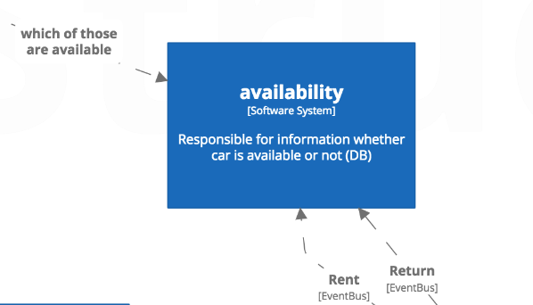
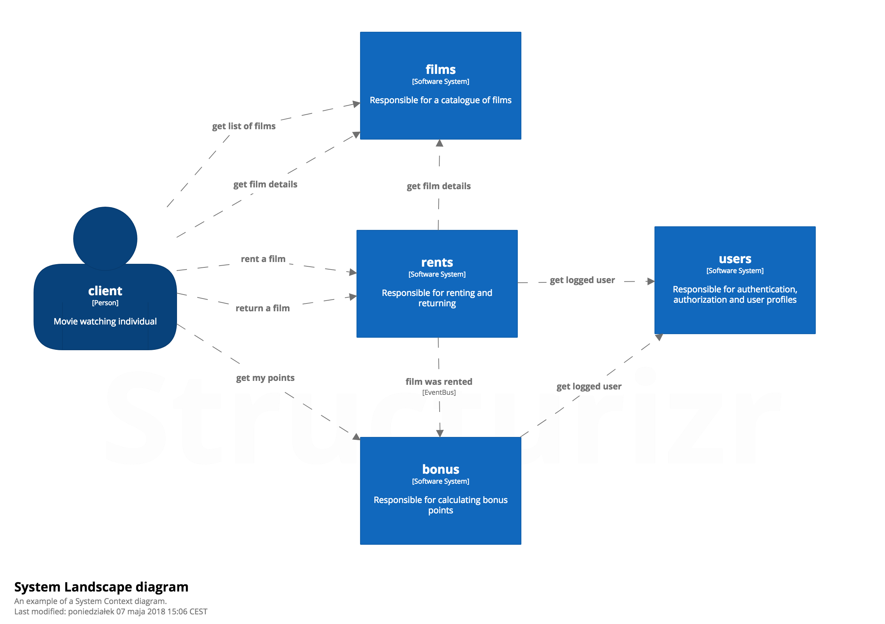
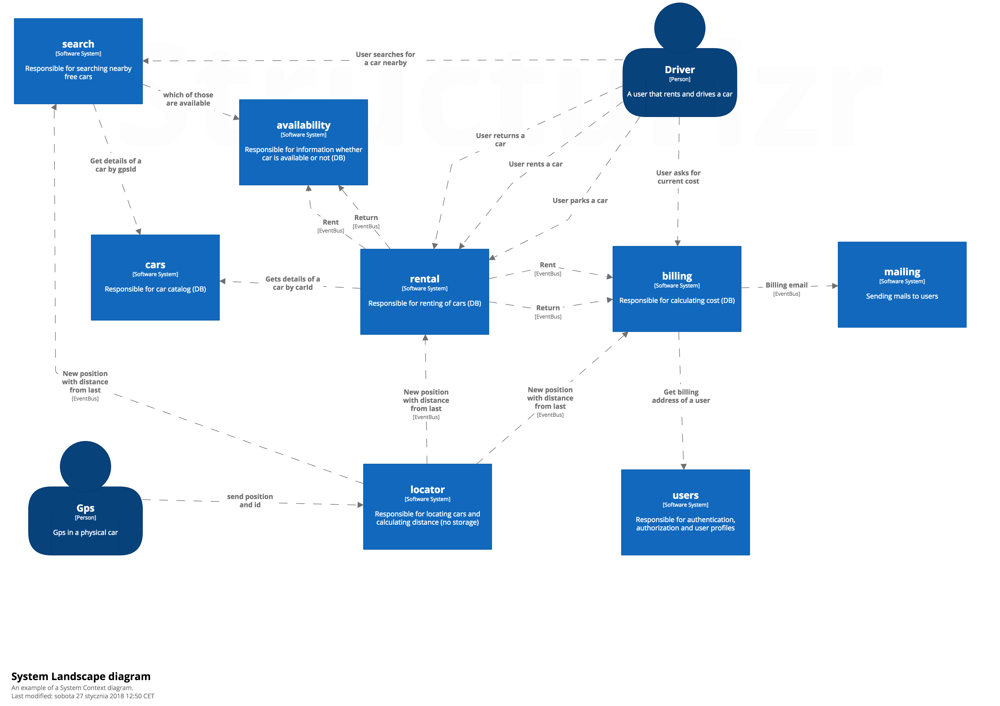

# Improving TDD — a Walkthrough

A port of Jakub Nabrdalik's *Improving your Test Driven Development in 45 minutes* from Java/Spock to TypeScript/NestJS. The talk's thesis is simple and uncomfortable: most TDD failures are failures of level. Class-level tests break on every refactor and rarely prove behaviour. Whole-system tests are slow, flaky, and expensive. The right unit of test is **the module** — the bounded context. Test its public facade against real in-memory collaborators, mock only the facades of *other* modules, and keep I/O tests for crucial paths only. This guide walks the eleven principles from the talk and points at the running demo under `apps/library/`.

- Talk (video): <https://www.youtube.com/watch?v=2vEoL3Irgiw>
- Slides: <https://jakubn.gitlab.io/improvingtdd/>
- Attribution: Jakub Nabrdalik

## How to run this

```bash
pnpm install
pnpm test:unit
pnpm test:integration    # requires Docker (testcontainers spins up postgres:16)
pnpm --filter library start:dev
```

---

## Principle 1 — Don't test too low


When you write a test per class and per method, every refactor turns red even when behaviour is unchanged. Coverage climbs to 100% but the tests pin implementation, not requirements. You stop refactoring because the tests punish you for it.

The demo never has a `catalog.repository.spec.ts` or a `loan.entity.spec.ts`. There are no tests on private helpers inside a facade. When the repository changes shape — in-memory `Map` today, Drizzle tomorrow — no facade test moves.

One spec file for the whole Catalog module. Every test drives through the public facade — no `catalog.repository.spec.ts`, no test for the private `updateCopyStatus` helper.

```ts
// apps/library/src/catalog/catalog.facade.spec.ts
describe('CatalogFacade', () => {
  it('adds a book and finds it by isbn', async () => {
    const catalog = buildFacade();
    const added = await catalog.addBook(sampleNewBook({ isbn: '978-0134685991' }));
    expect(await catalog.findBook('978-0134685991')).toEqual(added);
  });

  it('marks an available copy unavailable', async () => {
    const catalog = buildFacade();
    const book = await catalog.addBook(sampleNewBook());
    const copy = await catalog.registerCopy(book.bookId, sampleNewCopy({ bookId: book.bookId }));
    const updated = await catalog.markCopyUnavailable(copy.copyId);
    expect(updated.status).toBe(CopyStatus.UNAVAILABLE);
  });
});
```

The private helper it rides through:

```ts
// apps/library/src/catalog/catalog.facade.ts — no dedicated test, covered transitively
private async updateCopyStatus(copyId: CopyId, status: CopyStatus): Promise<CopyDto> {
  const copy = await this.repository.findCopyById(copyId);
  if (!copy) throw new CopyNotFoundError(copyId);
  const updated: CopyDto = { ...copy, status };
  await this.repository.saveCopy(updated);
  return updated;
}
```

---

## Principle 2 — Don't test too high


Full-stack tests against real HTTP and a real database catch integration bugs but they cost you seconds per case. A thousand of those and you wait 45 minutes for the suite. Developers stop running it locally, CI becomes the only signal, and feedback collapses.

The demo reserves full-stack testing for *crucial paths only* — one integration test per module plus the return-loan atomicity test. Every other scenario — corner cases, error paths, the reservation DSL — runs in memory at facade level.

Captured vitest output from `pnpm test:unit`:

```
✓ |unit| src/catalog/catalog.facade.spec.ts  (11 tests) 4ms
✓ |unit| src/membership/membership.facade.spec.ts  (12 tests) 4ms
✓ |unit| src/lending/lending.reservations.spec.ts  (2 tests) 3ms
✓ |unit| src/lending/lending.facade.spec.ts  (15 tests) 8ms

 Test Files  4 passed (4)
      Tests  40 passed (40)
   Duration  959ms (transform 203ms, setup 0ms, collect 1.99s, tests 19ms)
```

Forty tests, nineteen milliseconds of actual assertions. The rest is cold-start overhead that disappears in watch mode.

The only place a Postgres testcontainer shows up for Lending — everything else is in memory:

```ts
// apps/library/test/lending.return-loan.integration.spec.ts
suite('Lending returnLoan atomicity (real Postgres)', () => {
  let fixture: PostgresFixture;
  let app: INestApplication;

  beforeAll(async () => {
    fixture = await startPostgres();
    app = await createTestApp({ databaseUrl: fixture.connectionUrl });
    failingRepo = installFailingReservationRepo(app.get(LendingFacade));
  }, 120_000);

  it('rolls back the loan update when the fulfillment write fails inside the tx', async () => {
    // given alice borrowed a book and bob has a pending reservation for it
    const loan = (await borrowCopy(app, alice.memberId, copy.copyId)).body;
    await reserveBook(app, bob.memberId, book.bookId);
    failingRepo.armFailure();

    // when alice tries to return — fulfillment write throws inside the tx
    // then the loan update rolls back
    // …
  });
});
```

---

## Principle 3 — Test your modules



A module is a bounded context: it owns its data, exposes one public API, and has a clear set of collaborators. That is the natural unit of test. Not a class, not the whole system — the module. A module is also the thing you might one day extract into a microservice; test it like you'd test that microservice.

The demo has exactly three modules — `catalog`, `membership`, `lending`. Each one owns its repositories, its types, its facade. Each one has a single entry point via its barrel file, and that barrel exports only the facade class and the DTOs its signatures mention.

### Domain invariants live in the facade, not in a pipe

A knock-on question when you see how small the facade stays: *where does validation go?* Two honest options:

1. **Transport-level shape checks** (malformed JSON, wrong types) belong on the controller — `class-validator` decorators and a NestJS `ValidationPipe`. They catch bad HTTP requests before the facade runs.
2. **Domain invariants** (non-empty name, well-formed email, eligibility rules, duplicate-email) belong **inside the facade**, next to the state they guard.

The demo uses option 2 for anything the business cares about. Every facade guards its own invariants:

- `CatalogFacade.addBook` rejects blank title, zero authors, and malformed ISBNs (accepts ISBN-10 or ISBN-13, with or without hyphens).
- `CatalogFacade.registerCopy` rejects any `condition` outside `NEW | GOOD | FAIR | POOR`.
- `MembershipFacade.registerMember` rejects blank name, malformed email, and duplicate emails.

All are covered by fast facade tests (no `ValidationPipe`, no app boot). If the only enforcement were a controller-side pipe, another caller — a different controller, a CLI, another module — could skip the rule entirely. Putting it in the facade makes the rule true regardless of who calls in.

#### Keeping the facade readable — schemas per module

Inlining `if (!isValid) throw …` in the facade gets noisy fast. The demo separates *parsing the input* from *applying the business rule*, using a small **zod schema per module**:

```ts
// apps/library/src/catalog/catalog.schema.ts
export const NewBookSchema = z.object({
  title: z.string({ required_error: 'title is required' }).trim().min(1, 'title is required'),
  authors: z
    .array(z.string().trim())
    .transform((authors) => authors.filter((a) => a.length > 0))
    .refine((authors) => authors.length > 0, 'at least one author is required'),
  isbn: z
    .string({ required_error: 'isbn is required' })
    .trim()
    .min(1, 'isbn is required')
    .refine(isValidIsbn, (raw) => ({ message: `isbn format is invalid: ${raw}` })),
});

export function parseNewBook(input: unknown): z.infer<typeof NewBookSchema> {
  const result = NewBookSchema.safeParse(input);
  if (!result.success) {
    throw new InvalidBookError(result.error.issues[0]?.message ?? 'invalid input');
  }
  return result.data;
}
```

The facade becomes a single line of parsing plus the domain orchestration — nothing else:

```ts
// apps/library/src/catalog/catalog.facade.ts
async addBook(dto: NewBookDto): Promise<BookDto> {
  const { title, authors, isbn } = parseNewBook(dto);

  const existing = await this.repository.findBookByIsbn(isbn);
  if (existing) throw new DuplicateIsbnError(isbn);

  const book: BookDto = { bookId: this.newId(), title, authors, isbn };
  await this.repository.saveBook(book);
  return book;
}
```

Three things to notice about this split:

1. **Zod is an implementation detail, not a public contract.** The helper (`parseNewBook`) catches zod's error and re-throws `InvalidBookError` — the module's own domain error. Callers, tests, and other modules never see `ZodError`. If you later swap zod for Valibot, class-validator, or hand-written checks, nothing outside `catalog.schema.ts` changes.

2. **The schema lives *inside* the module.** It is not re-exported from `catalog/index.ts`, not shared across modules. Membership has its own. If two modules ever need the same schema, that is a signal the concept is a shared module — not a shared schema utility.

3. **Tests stay identical.** They assert on `InvalidBookError`, not on zod messages:

```ts
// apps/library/src/catalog/catalog.facade.spec.ts — unchanged by the refactor
it('rejects adding a book with a malformed isbn', async () => {
  const catalog = buildFacade();
  await expect(catalog.addBook(sampleNewBook({ isbn: 'not-an-isbn' }))).rejects.toThrow(
    InvalidBookError,
  );
});
```

### Why "Facade" and not "Service"?

The name is load-bearing. "Service" is ambiguous — a typical NestJS codebase grows many services per feature (`UserService`, `UserValidationService`, `UserQueryService`) and any of them can be injected anywhere. The name tells you nothing about what is an entry point and what is an internal helper.

"Facade" (in the [GoF sense](https://en.wikipedia.org/wiki/Facade_pattern)) names the role precisely: *the single simplified interface to a subsystem*. In this codebase that maps to a hard rule:

- **One facade per module.** `CatalogFacade` is **the** public API of Catalog — not *a* public API.
- **It is the only class re-exported from the barrel.** Repositories, in-memory implementations, Drizzle implementations, private helpers like `updateCopyStatus` — none of them leave the module.
- **Other modules depend on the facade type, never on internals.** `LendingFacade` holds a `CatalogFacade`, not a `CatalogRepository`.
- **Outsiders cannot reach internals** — the barrel file plus ESLint's `no-restricted-paths` enforce it structurally.

Rename it to `CatalogService` and that contract disappears into convention. Tomorrow someone adds a `CatalogQueryService`, imports a repository directly, and the module boundary starts to leak. It is the same reason Principle 7 is phrased "mock other modules' *facades*" rather than "mock other modules' services" — the name *is* the seam.

The public surface of the Catalog module is this file. Everything else is internal.

```ts
// apps/library/src/catalog/index.ts
export { CatalogFacade } from './catalog.facade.js';
export { CatalogModule } from './catalog.module.js';
export {
  BookNotFoundError,
  CopyNotFoundError,
  CopyStatus,
  DuplicateIsbnError,
  type BookDto,
  type BookId,
  type CopyCondition,
  type CopyDto,
  type CopyId,
  type Isbn,
  type NewBookDto,
  type NewCopyDto,
} from './catalog.types.js';
```

---

## Principle 4 — Module as black box, in milliseconds


Inside a module, test the facade. Every flow, every corner case, every error path — as fast as the JS engine can run. No I/O, no Docker, no containers booting. You save the I/O tests for the crucial happy path and a small set of scenarios that prove the real adapter works.

The Catalog facade has eleven tests covering happy paths, error cases, and idempotency — all through the public API, none touching a database. Adding a new scenario is three lines in a describe block; you do not think about test infrastructure.

Error-case tests run as fast as the happy paths because there is nothing slow to reach for:

```ts
// apps/library/src/catalog/catalog.facade.spec.ts
it('throws BookNotFoundError when finding an unknown isbn', async () => {
  const catalog = buildFacade();
  await expect(catalog.findBook('978-0000000000')).rejects.toThrow(BookNotFoundError);
});

it('throws CopyNotFoundError when marking an unknown copy available', async () => {
  const catalog = buildFacade();
  await expect(catalog.markCopyAvailable('unknown-copy-id')).rejects.toThrow(CopyNotFoundError);
});

it('rejects adding a book with an isbn that already exists', async () => {
  const catalog = buildFacade();
  await catalog.addBook(sampleNewBookWithIsbn('978-0134685991'));
  await expect(catalog.addBook(sampleNewBookWithIsbn('978-0134685991'))).rejects.toThrow(
    DuplicateIsbnError,
  );
});
```

---

## Principle 5 — In-memory implementations, not mocks



Give each module a real in-memory implementation of its repository interface. Unit tests use *that*, not a mock. Real logic runs against real state — just not persisted state. You keep mocks for boundaries outside the module's control.

**The in-memory repo** (real code from `apps/library/src/catalog/in-memory-catalog.repository.ts:4-36`):

```ts
export class InMemoryCatalogRepository implements CatalogRepository {
  private readonly booksById = new Map<BookId, BookDto>();
  private readonly copiesById = new Map<CopyId, CopyDto>();

  async saveBook(book: BookDto): Promise<void> {
    this.booksById.set(book.bookId, book);
  }

  async findBookByIsbn(isbn: Isbn): Promise<BookDto | undefined> {
    for (const book of this.booksById.values()) {
      if (book.isbn === isbn) return book;
    }
    return undefined;
  }
  // …saveCopy, findCopyById, listBooks
}
```

**What `vi.mock` would have looked like** (do not do this):

```ts
vi.mock('./catalog.repository.js', () => ({
  CatalogRepository: vi.fn().mockImplementation(() => ({
    saveBook: vi.fn().mockResolvedValue(undefined),
    findBookByIsbn: vi.fn().mockResolvedValue(undefined),
    findBookById: vi.fn().mockResolvedValue({ bookId: 'b1', isbn: '...' }),
    saveCopy: vi.fn().mockResolvedValue(undefined),
    findCopyById: vi.fn().mockResolvedValue(undefined),
    listBooks: vi.fn().mockResolvedValue([]),
  })),
}));
```

**Why the first is preferred:** the in-memory repo runs real logic against real state, so a test like "add a book then list it" actually proves the facade wires `saveBook` and `listBooks` correctly. The mocked version only proves that `vi.fn` was called — you have to script every return value, and the moment the facade changes shape the mocks silently disagree with reality. In-memory doubles turn state into a first-class test input; mocks turn it into a puppet show.

### Bonus — transactions across functions

Some operations mutate state across multiple repository calls inside a single module and must succeed or fail as a unit. In the demo, `returnLoan` does two things atomically within Lending: marks the loan returned, and — if a pending reservation exists — records its fulfillment. The `LoanReturned` and `ReservationFulfilled` events are staged with those writes so they only fire once the transaction commits. See `apps/library/src/lending/lending.facade.ts:58-75`.

The way we keep that unit-of-work testable without a database is a `TransactionalContext` abstraction. Repos accept it as a parameter and route writes through it. The in-memory implementation (`apps/library/src/lending/in-memory-transactional-context.ts:8-48`) stages writes into a scratch buffer and applies them only when `run()` resolves; on throw, the buffer is discarded and the `Map`-backed stores and event bus are untouched. The Drizzle implementation (`apps/library/src/lending/drizzle-transactional-context.ts:11-55`) threads a `tx` handle through a `db.transaction` block; Postgres handles commit and rollback. Same interface, same atomicity contract — the unit test survives the substrate swap.

This is scoped to **one module's own data**. The cross-module call `catalog.markCopyAvailable(...)` lives *outside* `tx.run(...)` — cross-module consistency is via happens-before ordering and events, never a shared transaction (see principle 7). That separation also avoids concurrent-connection deadlocks against the same pool; the tx reserves one connection for Lending's writes, and Catalog's write runs independently.

---

## Principle 6 — Don't let I/O escape the module



If your facade accepts a repository as a method parameter, every consumer will inject a mock and start asserting on repository calls. The test suite drifts back to implementation-level. The fix: expose a factory that wires the facade with its own in-memory defaults and accepts overrides only for injected *collaborators from other modules*.

In the demo, `createCatalogFacade()` is the factory. Its only overrides are a seed for deterministic ids and (in Lending) other modules' facades and the event bus. The repository is never in the signature — callers cannot reach it.

The factory function:

```ts
// apps/library/src/catalog/catalog.configuration.ts
export interface CatalogOverrides {
  repository?: CatalogRepository;
  newId?: () => string;
}

export function createCatalogFacade(overrides: CatalogOverrides = {}): CatalogFacade {
  const repository = overrides.repository ?? new InMemoryCatalogRepository();
  const newId = overrides.newId;
  return newId ? new CatalogFacade(repository, newId) : new CatalogFacade(repository);
}
```

The test takes no repository argument; it could not reach for one even if it wanted to:

```ts
// apps/library/src/catalog/catalog.facade.spec.ts
function buildFacade() {
  return createCatalogFacade({ newId: sequentialIds() });
}
```

---

## Principle 7 — Module boundaries: use other modules' facades, never their internals


When module A depends on module B, A's unit tests interact with B *only through B's facade* — never B's internals, never A's own repository. That rule is what the principle protects. Mocking your own repo just lets you assert on implementation details; reaching into B's internals couples A's tests to B's structure.

The talk's original phrasing is "mock other modules' facades." In the TypeScript port there is an even cleaner answer: **let the other module hand you its facade, wired with its own in-memory defaults.** That is what the `createXFacade()` factories are for (Principle 6). The factory-produced facade runs zero I/O — it *is* the test double. Hand-rolling a fake duplicates work the module already did.

Lending depends on `CatalogFacade` and `MembershipFacade`. Its tests wire the *real* facades:

```ts
// apps/library/src/lending/lending.facade.spec.ts
import { createCatalogFacade } from '../catalog/catalog.configuration.js';
import { createMembershipFacade } from '../membership/membership.configuration.js';

function buildSceneWith(extra: Partial<LendingOverrides>): Scene {
  const catalog = createCatalogFacade({ newId: sequentialIds('cat') });
  const membership = createMembershipFacade({ newId: sequentialIds('mem') });
  const bus = new InMemoryEventBus();
  const facade = createLendingFacade({
    catalogFacade: catalog,        // real CatalogFacade, in-memory repo behind it
    membershipFacade: membership,  // real MembershipFacade, ditto
    eventBus: bus,
    newId: sequentialIds('loan'),
    clock: fixedClock,
    ...extra,
  });
  // …seedAvailableCopy() calls the real catalog.addBook + catalog.registerCopy
  // …seedMember() calls the real membership.registerMember
}
```

The ineligibility test reads like production: register a member, suspend them, try to borrow:

```ts
// apps/library/src/lending/lending.facade.spec.ts
it('rejects with MemberIneligibleError when the member is suspended, touching nothing', async () => {
  // given a suspended member and an available copy
  const copy = await scene.seedAvailableCopy();
  const alice = await scene.seedMember('Alice');
  await scene.membership.suspend(alice.memberId);

  // when the member tries to borrow
  await expect(scene.facade.borrow(alice.memberId, copy.copyId)).rejects.toBeInstanceOf(
    MemberIneligibleError,
  );

  // then no loan was recorded, no event emitted, and the copy is still available
  expect(await scene.facade.listLoansFor(alice.memberId)).toEqual([]);
  expect(scene.bus.collected()).toEqual([]);
  expect((await scene.catalog.findCopy(copy.copyId)).status).toBe(CopyStatus.AVAILABLE);
});
```

### Why this is Principle 7 in spirit, not a deviation

- Lending still only touches Catalog and Membership *through their public facades*. It never imports a `CatalogRepository`, never pokes at `member.status`.
- `LoanRepository` and `ReservationRepository` — Lending's OWN data — stay behind Lending's facade. The principle still forbids Lending's tests from reaching into them.
- The test still proves the behavioural contract across the seam ("ineligible member → no loan, no event") — it just uses real Membership behaviour rather than a scripted fake.

### When to hand-roll a fake anyway

Reach for a hand-written fake of another module's facade when the real in-memory version cannot reach the state you need to test:

- You want the other module to throw a specific error at a specific call (e.g., "what if Catalog's `markCopyAvailable` fails after Lending commits?"). The factory-wired real facade is too well-behaved to reproduce that.
- The other module is slow or nondeterministic even in memory (rare, but possible — think of a module whose in-memory version still opens files).
- You want to freeze the contract A depends on as test documentation, and changes to B should not break A's tests.

For the cases above, Lending keeps the option — `createLendingFacade` accepts any object matching the `CatalogFacade` / `MembershipFacade` shapes — but the demo never needs it.

### Lending's own repos stay in-memory, hand-armable

One hand-rolled double *does* stay: `ThrowingOnceReservationRepository`. But that is Lending's OWN reservation repo, not a cross-module fake — it exists only to force a mid-transaction failure and prove the atomicity contract. Principle 5 (in-memory doubles for your own data) with a tiny bit of failure injection.

---

## Principle 8 — Keep information to minimum


Every line in a test should earn its place. If you can delete a field and the test still proves the same requirement, delete it. What is explicit is crucial; what is implicit is defaulted. Readers learn what matters by what you bothered to write.

The sample-data helpers default everything a requirement does not care about. A borrow test that only cares about member id and copy id says exactly that — the builder fills in title, authors, condition, dueDate calculation.

Three small helpers, each following `sample…({overrides})`:

```ts
// apps/library/src/catalog/sample-catalog-data.ts
export function sampleNewBook(overrides: Partial<NewBookDto> = {}): NewBookDto {
  return {
    title: 'The Pragmatic Programmer',
    authors: ['Andrew Hunt', 'David Thomas'],
    isbn: '978-0135957059',
    ...overrides,
  };
}

export function sampleNewCopy(overrides: Partial<NewCopyDto> = {}): NewCopyDto {
  return {
    bookId: 'book-placeholder-id',
    condition: 'GOOD' satisfies CopyCondition,
    ...overrides,
  };
}
```

The add-and-find test mentions only the one field it cares about:

```ts
// apps/library/src/catalog/catalog.facade.spec.ts
it('adds a book and finds it by isbn', async () => {
  const catalog = buildFacade();
  const added = await catalog.addBook(sampleNewBook({ isbn: '978-0134685991' }));
  expect(await catalog.findBook('978-0134685991')).toEqual(added);
});
```

---

## Principle 9 — Sample data builders per module


Each module ships its own sample-data helpers — `sampleNewBook`, `sampleNewCopy`, `sampleNewMember`, `sampleBorrowRequest` — with sensible defaults and an `overrides` parameter. Exploratory tests become one line. Setup explosion does not happen, because you never write setup.

Builders live next to the module, not in a shared test folder. The moment two modules need the same builder, you have a shared domain concept you should extract into a module — not a shared test helper.

The canonical shape lives next to the Catalog module (see Principle 8). Lending follows the same pattern for its own requests:

```ts
// apps/library/src/lending/sample-lending-data.ts
export function sampleBorrowRequest(overrides: Partial<BorrowRequest> = {}): BorrowRequest {
  return {
    memberId: 'member-placeholder-id',
    copyId: 'copy-placeholder-id',
    ...overrides,
  };
}

export function sampleReserveRequest(overrides: Partial<ReserveRequest> = {}): ReserveRequest {
  return {
    memberId: 'member-placeholder-id',
    bookId: 'book-placeholder-id',
    ...overrides,
  };
}
```

---

## Principle 10 — Common interactions for integration


Integration tests deal with HTTP. Left raw, every test has to re-decide method, path, encoding, and serialization — and when a route changes, every test changes with it. Hide that behind small helpers named in the domain's voice.

The integration suite never writes `request(app).post('/books').send(dto)` inline. It calls `postNewBook(app, dto)`. The helper owns the HTTP mechanics; the test owns the domain statement.

Six helpers cover every HTTP call the Catalog integration test makes. Lending and Membership ship parallel files.

```ts
// apps/library/test/support/interactions/catalog-interactions.ts
export function postNewBook(app: INestApplication, dto: NewBookDto): HttpCall {
  return server(app).post('/books').send(dto);
}

export function getBook(app: INestApplication, isbn: string): HttpCall {
  return server(app).get(`/books/${encodeURIComponent(isbn)}`);
}

export function registerCopy(
  app: INestApplication,
  bookId: string,
  dto: NewCopyDto,
): HttpCall {
  return server(app).post(`/books/${bookId}/copies`).send(dto);
}

export function markCopyAvailable(app: INestApplication, copyId: string): HttpCall {
  return server(app).patch(`/copies/${copyId}/available`);
}

export function markCopyUnavailable(app: INestApplication, copyId: string): HttpCall {
  return server(app).patch(`/copies/${copyId}/unavailable`);
}
```

---

## Principle 11 — Show, don't tell (DSL)


If you would draw the domain state on a whiteboard, let the test look like the drawing. Build a tiny DSL per test file or per domain concept. The test stops poking at internal fields and starts stating the requirement.

The reservation queue in Lending is naturally list-shaped: `alice, bob, carol` wait for a book, the earliest-queued is fulfilled when someone returns. The test reads like that:

```ts
// apps/library/src/lending/lending.reservations.spec.ts:137-149
await dsl.after('alice').reserves(book);
await dsl.after('bob').reserves(book);
await dsl.after('carol').reserves(book);

expect(await dsl.queueFor(book)).toEqual(['alice', 'bob', 'carol']);
```

`after`, `reserves`, `queueFor`, and `whenReturned` are a four-verb DSL defined in `apps/library/src/lending/testing/reservation-dsl.ts:16-33`. Two tests use it (`apps/library/src/lending/lending.reservations.spec.ts:137-168`); the rule of three says wait before extracting more helpers.

---

## Ports & gaps — where the TypeScript port diverges from Groovy/Spring

The talk is Java and Spock. Some of Jakub's examples rely on language features that do not exist in TypeScript; the port uses the closest honest equivalent and calls out the gap.

- **No operator overloading.** Jakub uses `B >> F` to express "move B under F" in a tree-DSL. TypeScript cannot overload operators. The demo uses method chains (`dsl.after(alice).reserves(book)`) and fluent builders instead.
- **No Spock `given:/when:/then:` labels.** Spock makes three-phase tests a language feature. The demo uses plain comments (`// given…`, `// when…`, `// then…`) inside each `it()` block. Readable, not structural.
- **No `@Autowired` test wiring.** Spring's test runner assembles collaborators out of the container. The demo uses plain factory functions (`createCatalogFacade({ overrides })`) — no `Test.createTestingModule`, no decorators in the test file. The facade class is `@Injectable()` so production wiring still works; tests sidestep the container entirely.
- **No Java package-private visibility.** In Java, module-internal classes are naturally invisible to callers outside the package. TypeScript has no equivalent. The demo enforces the boundary with a barrel file (`index.ts`) that re-exports only the facade and DTOs, plus an ESLint `no-restricted-paths` rule that rejects imports reaching into a module's internals.

---

## Summary

Jakub's own summary from slide 61:

> Focus on testing modules. Test the behaviour, not implementation. Prepare sample test data. Hide API for integration under meaningful methods. Build a small DSL. Extract code that slows integration tests into self-tested jars. Tests == specifications == requirements.
